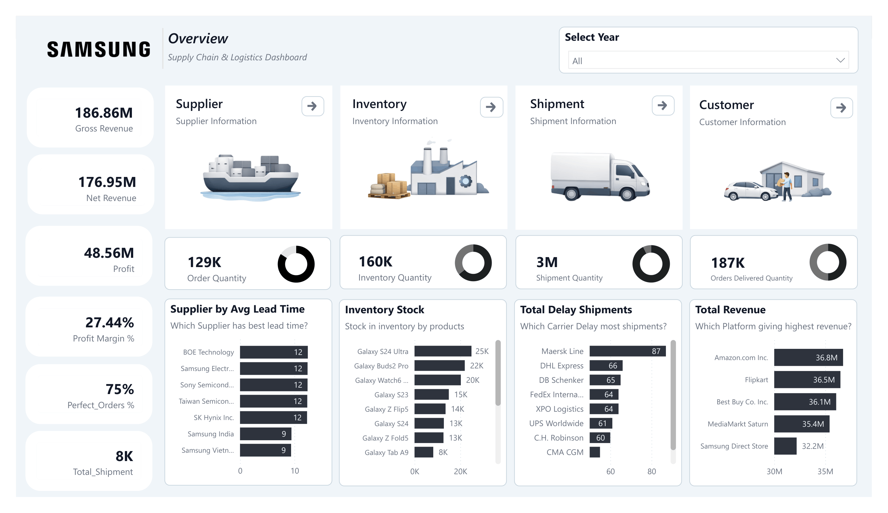
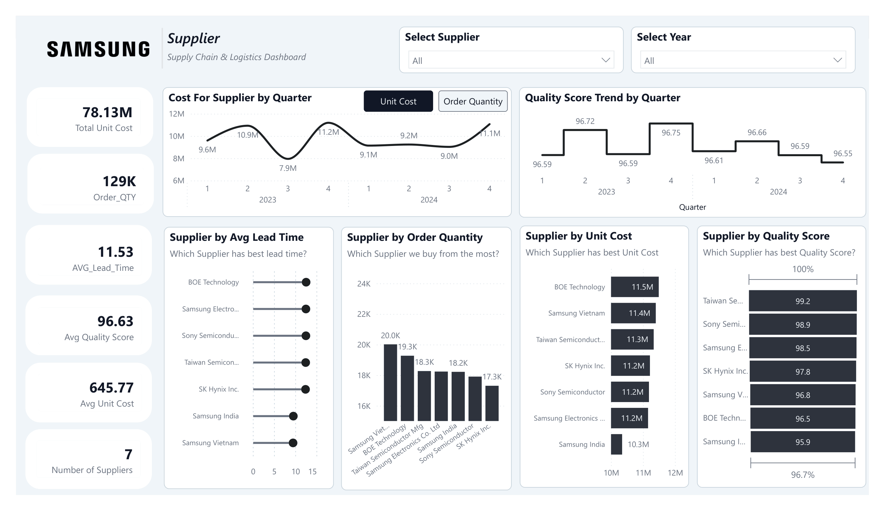
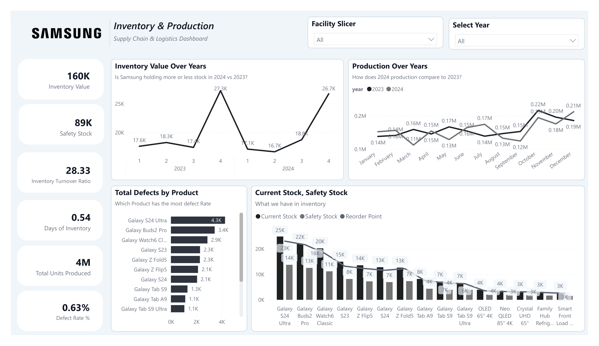
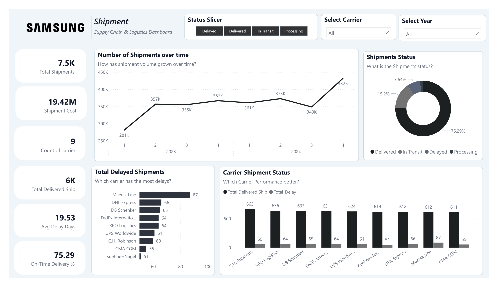
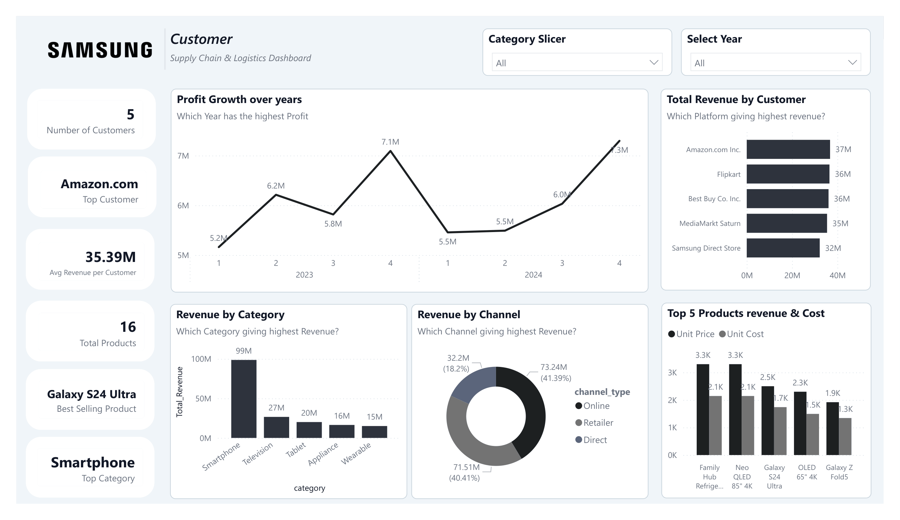

# 📦 Samsung Supply Chain & Logistics Dashboard


---

## 📌 Project Overview

An end-to-end **Supply Chain & Logistics Dashboard** built in Power BI for Samsung Electronics, covering the full supply chain cycle from procurement and production to inventory management, shipment tracking, and customer revenue analysis.

The dashboard spans **2 years of data (2023–2024)** across 10 datasets with over **24,000+ records**, providing actionable insights for supply chain stakeholders across 6 interactive pages.

---

## 🎯 Objectives

- Monitor end-to-end supply chain performance in real time
- Identify bottlenecks in supplier lead times, shipment delays, and inventory levels
- Track production quality and defect rates across facilities
- Analyze customer revenue and product profitability
- Enable data-driven decision making for procurement and logistics teams

---

## 📷 Dashboard Preview

### Overview Dashboard


### Supplier Dashboard


### Inventory & Production Dashboard


### Shipment Dashboard


### Customer & Product Dashboard


---

## 🔍 Key Insights

### 💰 Financial
- **Gross Revenue: $186.86M** | Net Revenue: $176.95M | Profit: $48.56M
- **Profit Margin: 27.44%** — healthy margin for electronics industry
- **Smartphones drive 53% of total revenue** ($99M out of $186.86M)
- Amazon.com is the **top customer at $37M** revenue

### 🏭 Supplier
- **7 suppliers** across 6 countries with avg quality score of **96.63/100**
- Best supplier quality: **Taiwan Semiconductor (99.2)**
- Avg lead time: **11.53 days** — Samsung Vietnam fastest at 9 days
- Procurement costs peak in **Q4 (Oct-Nov)** — seasonal demand surge

### 📦 Inventory & Production
- **Total Units Produced: 3.83M** across 2 years
- **Defect Rate: 0.63%** — well below industry average of 1-2%
- **Inventory Turnover Ratio: 28.33** — highly efficient just-in-time model
- **Days of Inventory: 0.54** — stock moves in under 1 day
- Galaxy S24 Ultra has the highest defect count (4.3K) but lowest defect rate %

### 🚚 Shipment
- **7,500 total shipments** with **75.29% on-time delivery rate**
- **573 delayed shipments** with avg delay of **19.53 days**
- **Maersk Line has the most delays (87)** — highest risk carrier
- **DHL Express has the longest avg delay (20.71 days)**
- Shipment volume grew **54%** from Q1 2023 (281K) to Q4 2024 (432K)
- January and June have the worst delay rates

### 👥 Customer
- **5 customers** across Online, Retailer, and Direct channels
- **Online channel generates 41.39%** of total revenue ($73.24M)
- Avg revenue per customer: **$35.39M**
- All 5 customers contribute relatively equally — no single dependency risk

---

## 🗂️ Dataset Description

| Table | Rows | Description |
|---|---|---|
| `fact_sales` | 8,500 | Sales transactions with revenue, profit, discounts |
| `fact_shipment` | 7,500 | Shipment records with carrier, status, delay reasons |
| `fact_inventory` | 1,152 | Daily stock levels, safety stock, reorder points |
| `fact_production` | 4,500 | Production output, defective units per batch |
| `fact_procurement` | 2,200 | Purchase orders, lead times, supplier quality scores |
| `dim_product` | 16 | Product catalog with pricing and specifications |
| `dim_customer` | 5 | Customer profiles with channel and volume data |
| `dim_supplier` | 7 | Supplier details with tier and quality ratings |
| `dim_facility` | 6 | Manufacturing and warehouse facility information |
| `dim_date` | 731 | Date dimension (2023–2024) with year, quarter, month |

---

## 🧮 Key DAX Measures

```dax
-- On-Time Delivery %
On-Time Delivery % = 
DIVIDE(
    CALCULATE(COUNT(fact_shipment[shipment_id]), 
    fact_shipment[status] = "Delivered"),
    COUNT(fact_shipment[shipment_id])
) * 100

-- Defect Rate %
Defect Rate % = 
DIVIDE(
    SUM(fact_production[defective_units]),
    SUM(fact_production[quantity_produced])
) * 100

-- Days of Inventory
Days of Inventory = 
DIVIDE(
    AVERAGE(fact_inventory[stock_level]),
    DIVIDE(SUM(fact_sales[quantity_sold]), 731)
)

-- Avg Delay Days
Avg Delay Days = 
CALCULATE(
    AVERAGEX(
        fact_shipment,
        DATEDIFF(
            LOOKUPVALUE(dim_date[date], dim_date[date_key], fact_shipment[ship_date_key]),
            LOOKUPVALUE(dim_date[date], dim_date[date_key], fact_shipment[delivery_date_key]),
            DAY
        )
    ),
    fact_shipment[status] = "Delayed"
)

-- Inventory Turnover Ratio
Inventory Turnover Ratio = 
DIVIDE(
    SUM(fact_sales[total_cost]),
    AVERAGEX(
        VALUES(fact_inventory[date_key]),
        CALCULATE(
            SUMX(fact_inventory, 
                fact_inventory[stock_level] * RELATED(dim_product[unit_cost])
            )
        )
    )
)
```

---

## 🛠️ Tools & Technologies

| Tool | Usage |
|---|---|
| **Power BI Desktop** | Dashboard development, DAX measures, data modeling |
| **DAX** | Custom measures and calculated columns |
| **Power Query** | Data transformation and cleaning |

---

## 📐 Data Model

The dashboard uses a **Star Schema** design:

```
                    dim_date
                       │
dim_supplier ──── fact_procurement
                       
dim_product ─┬── fact_sales ──────── dim_customer
             ├── fact_inventory ──── dim_facility
             ├── fact_production ─── dim_facility
             └── fact_shipment ───── dim_customer
                                     dim_facility
```

---

## 🚀 How to Use

1. **Clone the repository**
```bash
git clone https://github.com/yourusername/samsung-supply-chain-dashboard.git
```

2. **Open the dashboard**
   - Open `Samsung_SupplyChain.pbix` in Power BI Desktop
   - Data is embedded — no connection setup needed

3. **Navigate the dashboard**
   - Use the **top navigation buttons** on each page to switch between pages
   - Use the **Select Year** slicer (top-right) to filter by 2023 or 2024
   - Use the **Quarter and Month** slicers for deeper time filtering
   - Click any chart element to **cross-filter** other visuals

4. **Interact with charts**
   - Hover over any data point for detailed tooltips
   - Use the toggle button on Cost Per Month chart to switch between Unit Cost and Order Quantity

---

## 📁 Repository Structure

```
samsung-supply-chain-dashboard/
│
├── README.md
├── dashboard/
│   └── Samsung_SupplyChain.pbix
├── data/
│   ├── dim_product.csv
│   ├── dim_customer.csv
│   ├── dim_supplier.csv
│   ├── dim_facility.csv
│   ├── dim_date.csv
│   ├── fact_sales.csv
│   ├── fact_inventory.csv
│   ├── fact_procurement.csv
│   ├── fact_shipment.csv
│   └── fact_production.csv
├── screenshots/
│   ├── overview.png
│   ├── supplier.png
│   ├── inventory_production.png
│   ├── shipment.png
│   └── customer_product.png
└── docs/
    ├── data_dictionary.xlsx
    └── dax_measures.txt
```

---

## 💡 Recommendations Based on Analysis

1. **Switch primary carrier from Maersk Line** — highest delays (87) and 18.86 avg delay days
2. **Investigate January and June shipment delays** — consistently worst months for on-time delivery
3. **Monitor Galaxy Buds2 Pro defect trend** — highest defect rate among products
4. **Diversify customer base** — only 5 customers creates revenue concentration risk
5. **Leverage Vietnam supplier advantage** — Samsung Vietnam has fastest lead time (9 days) and should be prioritized for high-demand products

---

## 👤 Author

**Mohamed Mostafa**
- LinkedIn: [https://www.linkedin.com/in/mohammed-mostaafaa/]
- GitHub: [https://github.com/mohamedmostafa2003ss]
- Email: mohamedmostafa2003ss@gmail.com

---

## 📄 License

This project is for educational and portfolio purposes.
Dataset is simulated and does not represent actual Samsung Electronics data.

---

⭐ **If you found this project useful, please give it a star!**
